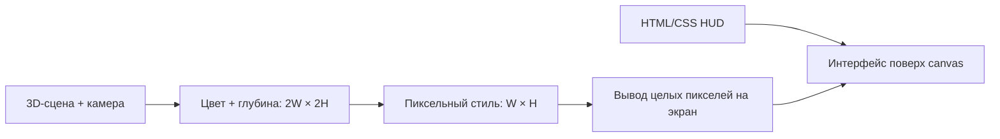

# Pixel Protocol — передача проекта разработчику

Описание текущей реализации на 25 сентября 2026 года. Версия в `package.json`: **2.7.0**. Источник истины для баланса и поведения — код в `src/`; этот документ описывает уже реализованную игру. Pixel Protocol — рабочее название, проверка окончательного названия перед публикацией не завершена. Будущие этапы отделены от текущих возможностей в [ROADMAP.md](ROADMAP.md).

## 1. Что это за игра

Одиночный браузерный 3D-шутер с видом сверху под углом. Игрок управляет бойцом на промышленной космической станции, отражает волны пришельцев, собирает оружие и припасы, покупает улучшения и проходит повторяющийся маршрут из трёх секторов. Забег продолжается до гибели, сложность растёт с номером волны.

Визуальный стиль — процедурные объёмные модели и окружение с пиксельными материалами и специальным проходом обработки изображения. Боевая логика в основном работает на плоскости XZ, высота Y используется для моделей, полёта снарядов и эффектов.

Игра рассчитана на компьютер с клавиатурой, мышью и WebGL 2. Итоговая поставка — один автономный `index.html`, который можно открыть двойным щелчком. Игровые ресурсы и библиотеки включены локально; сервер и интернет во время игры не требуются.

## 2. Игровой цикл и содержание

1. В меню можно настроить внешность и позывной бойца.
2. Новый забег начинается с M9, выбранным MP7, 100 здоровья, 40 брони, 180 кредитов и семи секунд подготовки.
3. Враги поступают из очереди постепенно. Волна заканчивается после уничтожения противников и исчерпания очереди появления.
4. За зачистку начисляются очки и кредиты, появляются лечение, броня, боеприпасы и доступное по прогрессу оружие. Пригодные награды автоматически собираются вместе с оставшимися предметами на карте.
5. Между волнами можно открыть снабжение. Обычный перерыв длится 11 секунд, после босса — 16 секунд; клавиша N запускает следующую волну досрочно.
6. Каждый третий бой содержит босса. После его волны следующий бой переносит игрока в новый сгенерированный сектор.
7. Смерть завершает забег. Снаряжение, покупки и текущая волна сбрасываются при новом старте; сохраняются профиль, настройки и рекорд.

### Сектора и волны

| Сектор | Оформление | Первый босс |
|---|---|---|
| DOCK 07 | Грузовой терминал, холодные металлические панели, бирюзовые акценты | Siege Behemoth, волна 3 |
| CRYO LAB | Криогенный комплекс, светлые холодные материалы, фиолетовые акценты | Neon Warden, волна 6 |
| REACTOR CORE | Реакторный комплекс, тёплые материалы и оранжевые акценты | Hive Queen, волна 9 |

Далее сектора и боссы повторяются. Переход происходит при начале следующей волны: 3 → 4, 6 → 7, 9 → 10. Оружие, магазины, резерв патронов, здоровье, броня, улучшения и таймер гранаты переносятся в новый сектор.

Есть четыре модификатора обычных волн: «Контакт», «Рой», «Прорыв», «Бронепанцирь». Они меняют здоровье, скорость и бюджет состава противников. Боссовые волны используют базовый модификатор и уменьшенный бюджет сопровождения. Серия убийств даёт множитель очков до ×4.

### Оружие

Параметры находятся в `WEAPONS`, боеприпасы — в `AMMO_TYPES` и `AMMO_PICKUP`, очередь разблокировок — в `WEAPON_UNLOCK` файла [src/60-weapons.js](src/60-weapons.js).

| Слот | ID / название | Механика | Доступность |
|---|---|---|---|
| 1 | `pistol` / M9 | Одиночный hitscan, бесконечный резерв, перезарядка магазина | Со старта |
| 2 | `shotgun` / SPAS-12 | Несколько поражающих лучей, поштучная перезарядка | После волны 1 |
| 3 | `smg` / MP7 | Скоростной автоматический hitscan | Со старта |
| 4 | `rifle` / M4 | Автоматический hitscan с пробитием | После волны 2 |
| 5 | `flamer` / Inferno | Урон в конусе и горение | После волны 3 |
| 6 | `minigun` / M134 | Автоматический hitscan, раскрутка стволов, снижение скорости движения | После волны 5 |
| 7 | `rocket` / RPG-7 | Летящий снаряд и взрыв по площади | После волны 7 |
| 8 | `plasma` / ARC-9 | Основная цель и цепной разряд до двух дополнительных целей | После волны 6 |
| 9 | `railgun` / Hyperion | Мощный пробивающий луч | После волны 8 |
| 0 | `autocannon` / Titan 30MM | Автоматические разрывные снаряды | После волны 9 |

Порог разблокировки делает оружие кандидатом на награду: после зачистки выбирается первое подходящее ещё не полученное оружие из очереди. Оно создаётся как предмет и тут же поступает в арсенал через общий сбор наград. Hitscan означает расчёт попадания лучом в момент выстрела; у ракет и снарядов автопушки есть время полёта, прямой урон при контакте и отдельный урон взрыва.

Поддерживаются отдача, разброс при движении, точное прицеливание, переключение оружия, прерывание перезарядки дробовика выстрелом, граната с дугой полёта и восстановлением за восемь секунд. Взрывы ракет и бочек могут ранить игрока; собственная граната его не повреждает.

### Противники

| ID | Роль |
|---|---|
| `crawler` | Быстрый малый противник ближнего боя |
| `grunt` | Обычный боец ближнего боя |
| `spitter` | Держит дистанцию, стреляет кислотой |
| `flyer` / Stinger | Быстрый летающий противник ближнего боя |
| `brute` | Медленный тяжёлый противник с большим запасом здоровья и предупреждаемым ударом по площади |
| `siege` | Босс ближнего боя с сейсмическим ударом по площади |
| `warden` | Босс с дистанционными залпами и близким энергетическим импульсом |
| `queen` | Босс с кислотными атаками, призывом помощников и круговой специальной атакой |
| `overmind` | Финал: три фазы со сменой набора атак, щит на переходе, кольцо зон опасности вместо смены арены |

Специальные атаки заранее обозначаются кругами опасности. При здоровье ниже 45% боссы ускоряются и сокращают интервалы атак; дистанционные боссы расширяют залпы, матка усиливает призыв. Баланс задаётся в `ENEMY_TYPES`, модификаторы конкретной волны применяются при появлении: базовое HP из таблицы не равно здоровью босса на поздней волне.

### Развитие, профиль и интерфейс

Снабжение доступно между волнами по B. Покупки улучшают урон, скорость перезарядки, предел здоровья и брони; отдельно продаются лечение и боеприпасы. Цены растут для последовательных уровней улучшений. Меню снабжения останавливает симуляцию и отсчёт подготовки.

Редактор бойца позволяет выбрать ник до 18 символов, кожу, волосы, одежду, бронежилет, шлем, наплечники, рюкзак и цвет подсветки. Есть готовые наборы, случайный облик, вращение, масштабирование и просмотр всех стволов. Ник поддерживает кириллицу, латиницу, цифры, пробел и символы `_-.`; готовые наборы и случайный облик сохраняют позывной.

HUD показывает здоровье, броню, рывок, гранату, патроны, оружие, волну, очки, кредиты, серию убийств, сектор, радар и здоровье босса. Ник виден в меню, HUD и над бойцом. В паузе доступны громкость, тряска камеры и размер пикселя. При потере фокуса активная игра ставится на паузу.

### Управление

| Действие | Управление |
|---|---|
| Движение | WASD / стрелки |
| Огонь / точное прицеливание | ЛКМ / удерживать ПКМ |
| Рывок / спринт | Space / Shift |
| Граната / перезарядка | G / R |
| Оружие | 1–9, 0; Q/E; колесо |
| Снабжение / следующая волна | B / N |
| Фонарь / музыка | F / M |
| Пауза | Esc / P |
| Старт / повтор забега | Enter |

| Геймпад | Действие |
|---|---|
| Левый стик / правый стик | Движение / прицеливание |
| A / B | Рывок / граната |
| X / Y | Перезарядка / фонарь |
| LB / RB | Предыдущее / следующее оружие |
| LT / RT | Точное прицеливание / огонь |
| View / Menu | Склад снабжения / пауза |
| Крестовина | Движение, выбор в открытом экране |
| Правый стик в редакторе | Вращение модели бойца |
| A / B в открытом экране | Нажать выбранное / закрыть экран |

Клавиши переназначаются на экране паузы; цифры выбора оружия и карточек доктрины остаются фиксированными. Устройство определяется само по первому нажатию. Устройство ввода, слой действий и кламп привязок описаны в разделе «Ввод и устройства».

## 3. Технологический стек

| Технология | Версия / размещение | Назначение |
|---|---|---|
| JavaScript | Обычные `.js` в `src/` | Игровая логика, генерация, ввод, AI, интерфейс |
| Three.js | r170, `vendor/three.module.js` | WebGL-сцена, геометрия, материалы, свет, тени, инстансинг, render targets |
| GLSL / ShaderMaterial | [src/55-pixel-renderer.js](src/55-pixel-renderer.js) | Пиксельная обработка цвета и глубины, вывод изображения |
| Tween.js | 25.0.0, `vendor/tween.module.js` | Проявление сектора, синхронизированное с игровым временем |
| HTML + CSS | [src/shell.html](src/shell.html) | Меню, HUD, редактор, магазин и настройки |
| Canvas 2D API | [src/20-textures.js](src/20-textures.js), HUD | Процедурные текстуры и радар |
| Web Audio API | [src/10-audio.js](src/10-audio.js) | Синтез звуков и адаптивной музыки |
| localStorage | `createProfileStore()` / `store` в `05-save.js` | Версионированный профиль, миграция, резервная копия, рекорд и настройки |
| Node.js | Среда последней проверки: 24.14.0 | Сборка и проверки; минимальная версия в manifest не объявлена |
| npm | [package.json](package.json), [package-lock.json](package-lock.json) | Команды проекта и закреплённый пакет Tween.js |
| Chrome / Edge headless + SwiftShader | [tools/smoketest.js](tools/smoketest.js) | Автоматическая проверка настоящего WebGL и снимки |

Логика реализована собственными классами, UI — DOM-элементами. Отдельного физического движка, сервера, базы данных, сетевого протокола и многопользовательского режима в текущей реализации нет.

`@tweenjs/tween.js` указан как `devDependency`, но его локальная копия включается в runtime-сборку. Three.js хранится непосредственно в `vendor/`, отдельно от npm-зависимостей. Сведения об источниках и лицензиях: [vendor/THIRD-PARTY.md](vendor/THIRD-PARTY.md).

## 4. Карта исходников

| Файл | Ответственность |
|---|---|
| [src/00-util.js](src/00-util.js) | Математика, seeded RNG с чтением/восстановлением состояния, Pool, SpatialHash |
| [src/05-save.js](src/05-save.js) | Профиль схемы 2, цепочка миграций, миграция прежних ключей, строгие булевы значения, восстановление и память при сбое хранения |
| [src/10-audio.js](src/10-audio.js) | `SfxEngine`: оружие, эффекты, голоса, музыкальный секвенсор |
| [src/15-simulation.js](src/15-simulation.js) | `FixedStepClock`, `SIM_DT`, `HitStop` и `HIT_STOP`, создание seed забега и `sectorSeed()` |
| [src/20-textures.js](src/20-textures.js) | `TEX`: пиксельные поверхности, разметка, карты нормалей, текстуры эффектов |
| [src/30-level.js](src/30-level.js) | `SECTOR_DEFS`, `LevelMap`: генерация, координаты, стены, коллизии, навигация |
| [src/40-models.js](src/40-models.js) | Процедурная геометрия бойца, пришельцев, оружия и предметов; общий риг рук |
| [src/45-customize.js](src/45-customize.js) | Схема внешности, очистка ника, сохранение, отдельная сцена редактора |
| [src/50-fx.js](src/50-fx.js) | Искры, дым, обломки, следы, трассеры, простые тени, вспышки, ударные волны |
| [src/55-pixel-renderer.js](src/55-pixel-renderer.js) | `PixelRenderer`: три прохода пиксельного изображения |
| [src/58-portraits.js](src/58-portraits.js) | `WeaponPortraits`: пиксельные портреты стволов для карточек склада, одноразовый рендерер, откат при сбое |
| [src/60-weapons.js](src/60-weapons.js) | Оружие, патроны, цены, доля возврата, число слотов арсенала, шанс и множитель крита, точки хвата, пороги появления в продаже |
| [src/70-enemies.js](src/70-enemies.js) | Типы врагов, `EnemyManager`, AI, специальные атаки, попадания, инстансинг |
| [src/80-player.js](src/80-player.js) | `ACTIONS` и привязки, `InputState` с клавиатурой и геймпадом, `Player`: движение, оружие, урон, граната, анимация |
| [src/86-hazards.js](src/86-hazards.js) | `Hazards`: зоны опасности на полу, окно взведения, урон по фиксированному тику, кольцо вентиляций |
| [src/85-world.js](src/85-world.js) | `LevelView`, `Props`, `Pickups`, `Projectiles`, освобождение ресурсов уровня |
| [src/90-hud.js](src/90-hud.js) | DOM-интерфейс, радар, уведомления, панель снабжения, статистика |
| [src/91-damagenumbers.js](src/91-damagenumbers.js) | `DamageNumbers`: всплывающие числа урона, слияние попаданий по цели, пул узлов, настройка отключения |
| [src/92-upgrades.js](src/92-upgrades.js) | Таблицы улучшений, модификаторов волн, перков и постоянных улучшений станции; теги, редкость, розыгрыш предложения и ассортимента, цены и кламп рангов |
| [src/93-uinav.js](src/93-uinav.js) | `UiNav`: поиск открытого экрана, фокус без мыши, пространственный выбор соседа, автоповтор удержания, ползунки и списки, раскладки и модель ввода экранной клавиатуры |
| [src/95-game.js](src/95-game.js) | `Game`: сборка сцены, состояние забега, волны, переходы, камера, общая симуляция |
| [src/99-main.js](src/99-main.js) | `boot()`, события интерфейса, настройки, главный цикл кадров |
| [src/shell.html](src/shell.html) | HTML/CSS и маркер вставки игрового кода |
| [tools/build.js](tools/build.js) | Создание автономного `index.html` |
| [tools/rigtest.js](tools/rigtest.js) | Геометрические проверки рук, хвата, дула и цвета без браузера |
| [tools/savetest.js](tools/savetest.js) | Профиль, цепочка схем, образцы и ранги станции, повреждения, блокировка хранилища, внешность и булевы значения |
| [tools/simulationtest.js](tools/simulationtest.js) | Фиксированный шаг, ограничение догоняющих шагов, переходы состояний, RNG и хит-стоп |
| [tools/combattest.js](tools/combattest.js) | Короткие нажатия, аналоговое движение и рывок, укрытия, бочки, прямой урон, криты, хит-стоп, взрыв и сбор наград |
| [tools/perktest.js](tools/perktest.js) | Таблица перков, теги, требования, пределы уровней, редкость и детерминизм предложений |
| [tools/shoptest.js](tools/shoptest.js) | Ассортимент склада: пороги волн, цены, дубликаты, замки, проданные слоты и цена обновления |
| [tools/elitetest.js](tools/elitetest.js) | Элитные модификаторы: пороги волн, доля от волны, иммунитет боссов, потомки сплиттера и детерминизм |
| [tools/controlstest.js](tools/controlstest.js) | Слой действий, кламп и сохранение привязок, фронты нажатий, кнопки и аналоговые стики геймпада |
| [tools/uinavtest.js](tools/uinavtest.js) | Таблица экранов, выбор соседа с заворотом, автоповтор, ползунки и списки, ключи фокуса, алфавит и предел экранной клавиатуры |
| [tools/bosstest.js](tools/bosstest.js) | Фазы финала, их изоляция от общей таблицы типов, щит перехода, взведение и тик зон опасности |
| [tools/navtest.js](tools/navtest.js) | Радиусы проходов, препятствия, бочки, seeded-карты, состояние врагов и интерполяция |
| [tools/replayprobe.js](tools/replayprobe.js) | Сравнение состояния настоящего `Game` при одинаковых командах по тикам; вызывается браузерным тестом |
| [tools/smoketest.js](tools/smoketest.js) | Браузерные проверки поведения и рендера, снимки |
| [.github/workflows/ci.yml](.github/workflows/ci.yml) | Windows CI: сборка, unit-тесты, headless-прогон, снимок и диагностические артефакты |

## 5. Сборка, запуск и область видимости

`tools/build.js` читает все `src/*.js` по алфавиту. Числовые префиксы задают порядок. Содержимое объединяется в одну IIFE — общую область видимости игры. Файлы исходников не являются независимыми ES-модулями: между ними используются общие классы, функции и таблицы.

В сборку включаются локальные Three.js и Tween.js. Скрипт преобразует финальные экспорты этих конкретных ESM-дистрибутивов в доступные игре пространства имён, затем вставляет код вместо `/*__GAME_BUNDLE__*/` в `src/shell.html`.

**Редактировать нужно `src/`, а затем пересобирать.** Ручные изменения `index.html` будут перезаписаны. При обновлении библиотек нужно сверить формат их дистрибутивов: сборщик ожидает плоский файл без импортов и поддерживаемый финальный `export`.

```powershell
# Из корня проекта. Форма npm.cmd подходит для Windows PowerShell.
node tools/build.js
Start-Process .\index.html

npm.cmd test
npm.cmd run test:unit

npm.cmd run shot
npm.cmd run shot:menu
node tools/smoketest.js 1 --customizer --weapon rifle --yaw 1.0 --shot preview-rifle.png
node tools/smoketest.js 1 --boss siege --weapon railgun --shot preview-boss.png
```

Браузерная проверка ограничена девятью минутами. На медленной машине с программным WebGL полного прогона это не хватает: поднимите предел переменной `CHROME_TIMEOUT_MS` (в миллисекундах).

Прямой вызов `smoketest.js` использует уже собранный `index.html`: после правок сначала выполните сборку. Команды `npm test`, `npm run shot` и `npm run shot:menu` включают её автоматически. Для обычной сборки `npm install` не нужен: необходимые библиотеки уже лежат в `vendor/`. `npm ci` нужен, если требуется восстановить npm-пакет для работы с зависимостями; он сам по себе не обновляет копии в `vendor/`.

## 6. Жизненный цикл и архитектура

`boot()` создаёт текстуры, базовые примитивы и геометрию предметов, затем `Game` и `Customizer`. `Game` владеет сценой, камерой, игроком, противниками, уровнем, эффектами, предметами, снарядами и HUD. Объекты систем получают ссылку на `game` для взаимодействия.

Главный цикл использует `requestAnimationFrame`, а симуляцию ведёт `FixedStepClock` с шагом `SIM_DT = 1 / 60`. `clock.advance(elapsed, callback)` вызывает `game.update(step)` до восьми раз за кадр и возвращает `{ steps, alpha }` для `game.render(alpha)`. Избыточное время долгой задержки отбрасывается и учитывается в `clock.droppedTime`: игра не пытается мгновенно проиграть всю пропущенную схватку. Возврат `false` из callback останавливает догоняющие шаги при смене состояния или уровня. На смене состояния, потере фокуса и открытии редактора накопленное время сбрасывается.

Хит-стоп (`HitStop` в [src/15-simulation.js](src/15-simulation.js)) отсчитывается в тиках, а не в миллисекундах, поэтому заморозка — часть симуляции и воспроизводится по seed. `Game.update()` тратит тик и при активной заморозке: мир стоит, но камера, вспышки и HUD продолжают обновляться, иначе эффект читается как просадка кадров. Заморозки не складываются — побеждает самая длинная, общий предел 0.12 с. Длительности заданы в `HIT_STOP`; `motionScale = 0` (настройка уменьшенного движения) полностью отключает эффект.

`InputState.pressed`, `mousePressed` и колесо сохраняются до обработки тика. `endFrame()` вызывается симуляцией, поэтому кадр без шага не теряет короткое нажатие, а несколько шагов в одном кадре не повторяют одно действие. Удержание огня и одиночное нажатие обрабатываются отдельно. Это буфер событий до тика, а не очередь команд для будущего окончания cooldown.

В рендере интерполируются положение и поворот бойца, камера, противники и снаряды. `Game.render(alpha)` временно меняет визуальные трансформации игрока и камеры, затем восстанавливает их в `finally`; расчёт следующего выстрела и `muzzleWorld()` получают состояние симуляции. `aimCamera` обновляется фиксированным шагом до косметической тряски, чтобы эффект не менял направление огня. Пока открыт полноэкранный редактор, обновляется его отдельная сцена с кадровым `dt`; скрытая основная сцена не отрисовывается.

Состояния `Game`: `menu`, `play`, `pause`, `dead`, `upgrade`, `perk`, `victory`. Состояние волны хранится отдельно: `prep` или `active`. Редактор представлен `Customizer._running` поверх меню. Переходы и поведение ввода находятся в `95-game.js` и `99-main.js`.

`newLevel(seed)` пересоздаёт геометрию уровня, окружение и временное боевое состояние. `advanceSector()` сначала собирает пригодные предметы, затем сохраняет параметры забега, создаёт новый уровень и восстанавливает снаряжение. `startRun(seed = freshRunSeed())` полностью сбрасывает прогресс, устанавливает `runSeed`, обнуляет `tick` и создаёт новый `game.rng`.

Игровая случайность — состав и появление врагов, их начальное состояние, разброс, награды и задержки цепных взрывов — использует `game.rng`. Планировка и окружение используют производный `sectorSeed(runSeed, sectorIndex)`, не расходуя поток боя. У генератора есть `getState()` / `setState()` для диагностики. `Math.random()` остаётся в косметических эффектах и резервном создании нового seed. Очередь `game.events` хранит события бочек как `{ dueTick, barrel }`; пауза останавливает их вместе с `game.tick`, смена карты очищает очередь.

Контракт воспроизводимости ограничен одинаковой версией игры, средой исполнения, размером окна и одинаковыми командами на одинаковых тиках. Проверка `replayprobe.js` сравнивает состояние при расписаниях 30/60/144 Гц и неравномерных кадрах, с разными настройками тряски, паузой, бочками и переходом сектора. Это проверка симуляции, а не готовый формат пользовательского реплея или гарантия побитового совпадения разных браузеров.

### Ввод и устройства

Игровой код спрашивает действия, а не коды клавиш: `input.actionDown('dash')`, а не `input.keys.Space`. Таблица `ACTIONS` в [src/80-player.js](src/80-player.js) — 17 действий, у каждого ярлык, клавиши по умолчанию и, где это осмысленно, кнопка геймпада. Переназначение, подсказки кнопок и будущая раскладка Steam Deck после этого становятся вопросом привязки, а не правки контроллера.

Цифры выбора оружия и карточек доктрины остаются буквальными кодами клавиш и в таблицу не входят: они позиционные («третий»), и переназначение заставило бы числа на экране врать.

`actionOnce()` гасит фронт у всех источников действия сразу. Иначе вторая клавиша, привязанная к тому же действию, выстрелила бы им ещё раз в том же тике. `clampBinds()` проверяет привязки при каждом чтении профиля: неизвестное действие отбрасывается, код клавиши обязан совпасть с `KEY_CODE`, дубликаты убираются, больше `MAX_BINDS_PER_ACTION` не хранится. Пустой список — осознанное «не назначено» и сохраняется; список, в котором не осталось ничего пригодного, откатывается к исходному, чтобы действие не осталось недоступным.

Геймпад опрашивается `pollPad()` один раз за игровой шаг, там же, где обрабатывается клавиатура: Gamepad API не шлёт событий, поэтому фронты вычисляются сравнением с прошлым снимком, и кадр без шага симуляции не может проглотить или повторить нажатие. Отключение пада очищает удержания — иначе кнопка осталась бы зажатой навсегда. `stick(xAxis, zAxis)` возвращает `null` внутри мёртвой зоны `PAD_DEADZONE`, а за её пределами перемасштабирует остаток в 0…1: без этого первое рабочее отклонение стика давало бы сразу треть скорости. Правый стик задаёт точку прицела в мировых координатах относительно бойца, а не подделывает позицию курсора, — иначе прицел уезжал бы вместе с упреждением камеры.

**Порядок нормализации в `Player.update()` — не косметика.** Вектор движения с клавиатуры нормализуется, иначе диагональ WA обгоняла бы прямую W. Стик читается **после** этой нормализации и приносит собственную длину: если нормализовать и его, любое отклонение стика превращается в бег на полной скорости, то есть ровно в то, ради чего аналоговый стик и нужен. Сам `stick()` при этом остаётся правильным, поэтому ошибка не видна ни в одном тесте слоя ввода — её ловит `combattest.js`, который двигает настоящего бойца. Рывок берёт из этого вектора только направление: стик, отклонённый чуть-чуть, идёт шагом, но рывок обязан быть полным.

### Навигация по меню

Экраны — обычный DOM, поэтому [src/93-uinav.js](src/93-uinav.js) двигает собственный фокус браузера, а не держит рядом отдельный выбор. Отсюда бесплатно следует: Enter и Space жмут подсвеченную кнопку нативно, длинный список сам прокручивается к фокусу, а подсветка по построению совпадает с тем, что браузер активирует. У геймпада такого пути нет, поэтому его кнопка A жмёт элемент явно — и только она: если читать здесь ещё и Enter, одна и та же кнопка нажмётся дважды.

`NAV_SCREENS` задаёт порядок поиска открытого экрана: доктрина и склад открываются поверх паузы, станция — поверх меню и экрана смерти, поэтому они стоят раньше. `first` — на чём экран открывается: игрок должен попадать на то, зачем пришёл, а не на первое в разметке. `back` — что жмёт кнопка B; у экрана доктрины его нет, и это не упущение, а правило: от выбора усиления нельзя отказаться.

`pickNeighbour()` — единственное место в файле, где принимается решение, поэтому оно чистое и получает прямоугольники, а не измеряет их само: так его можно проверить на настоящей раскладке магазина без браузера. Берётся ближайший элемент по направлению, боковое смещение штрафуется вдвое, чтобы сосед по прямой всегда обходил диагонального. Если впереди пусто, ряд заворачивается: на геймпаде последний пункт не должен быть тупиком.

Прямоугольники измеряются только в момент перехода. `querySelectorAll` дёшев и выполняется каждый тик, а `getBoundingClientRect()` вызывает пересчёт раскладки — переходов бывает несколько в секунду против шестидесяти тиков.

**Фокус запоминается по имени, а не по номеру** (`navKey()`). Магазин пересобирает всю сетку на каждой покупке; при фокусе по индексу он молча съезжал бы на карточку, занявшую освободившееся место.

Ползунок, флажок и выпадающий список отвечают на влево-вправо изменением значения, а не переходом: на геймпаде их больше нечем крутить. Нажатие съедается и на упоре — фокус, улетающий с громкости при 100, читается как сбой. Чтобы браузер не менял значение сам, пока фокус уходит с элемента, `99-main.js` гасит стрелки и WASD на время, пока экран открыт.

Пока в паузе взведена строка переназначения, навигация стоит на месте: экран ждёт клавишу, и терять на ней фокус значило бы отбрасывать игрока в начало списка из семнадцати строк после каждой привязки.

Редактор бойца в `NAV_SCREENS` не входит: там текстовое поле позывного, которому на Steam Deck нужна экранная клавиатура, и это отдельная работа.

### Ввод позывного без клавиатуры

Позывной — единственный текст в игре, и на геймпаде его нечем набрать. `#oskScreen` — экранная клавиатура, устроенная как обычный экран: поэтому навигация в ней замыкается сама по себе тем же механизмом, который уводит выбор в склад поверх паузы, и ничего для этого писать не пришлось.

**Текстовое поле исключено из `NAV_SELECTOR` намеренно.** Сфокусированное поле ввода забирает стрелки себе — они становятся кареткой, — и фокус на нём означал бы, что стрелки делают два разных дела в зависимости от того, где он стоит. Поле берётся кнопкой `#custKeyboard`, а мышь по-прежнему щёлкает прямо в поле.

`OSK_ROWS` — простые данные, и это главное в них: `tools/uinavtest.js` загружает настоящий `sanitizeNickname()` и проверяет каждый символ обеих раскладок. Клавиша, набирающая то, что профиль затем выбросит, заставила бы позывной редактировать себя сам у игрока на глазах, и заметить это в браузере намного дороже.

`NICKNAME_MAX` объявлен в [src/45-customize.js](src/45-customize.js) и используется и в `normalizeNickname()`, и в клавиатуре: предел принадлежит профилю, поэтому `oskType()` получает его аргументом, а не хранит свой. Набрать девятнадцатый символ и молча его потерять хуже, чем получить отказ на клавишу.

`oskType()` считает символы через `Array.from()`, а не по длине строки: одно нажатие — один символ, иначе удаление разрезало бы двухбайтовую букву пополам.

Клавиши строятся узлами с `textContent`, а не разметкой: в поле лежит то, что набрал игрок.

ESC и кнопка B выходят из внутреннего наружу — сначала клавиатура, затем редактор. Без этого порядка выход из клавиатуры закрывал бы весь редактор.

**Редактор живёт вне фиксированного шага:** пока он открыт, `game.update()` не вызывается вообще, и кадровая ветка в [src/99-main.js](src/99-main.js) раньше каждый кадр стирала ввод. Теперь навигация ведётся из этой же ветки, а ввод чистится на входе в редактор и на выходе из него — иначе клавиша, зажатая при выходе, приехала бы в забег.

### Финал: фазы и арена

Финал двенадцатой волны — `overmind`, отдельный тип со своей моделью. Три фазы задуманы как три разных боя: «Броня» — медленный, без дистанционных атак и подкреплений; «Роение» — подкрепления и залпы; «Ядро» — подкрепления прекращаются, скорость и частота атак растут. Проверки в `tools/bosstest.js` требуют именно этого, а не трёх строк с разными числами: дистанционные атаки обязаны появляться вместе с фазой, роить должна ровно одна фаза, последняя обязана быть быстрее первой.

**Фаза переписывает собственную копию типа.** `spawn()` выдаёт фазовому боссу `Object.assign({}, ti)`, а `applyPhase()` пишет поля фазы в эту копию. Благодаря этому AI, рендер и телеграф-кольца продолжают читать `d.<поле>` и не знают о фазах ничего — в горячем цикле не появилось ни одной проверки. Цена ровно одна и она проверяется отдельно: правки в общую таблицу оставили бы каждый следующий бой в сессии — и следующий забег — с последней фазой предыдущего. Обычный враг копию не получает.

`nextBossPhase(e)` вынесена из цикла AI, чтобы решение можно было спросить без уровня, сцены и игрока. Она же держит важное правило: **щит не пускает вторую фазу**. Попадание рельсы по почти добитому боссу пересекает два порога в одном тике, и без этого правила одна фаза была бы просто пропущена.

Щит (`e.shield`) — окно, в котором босс не получает урон и не атакует. Это то, что делает фазу битом боя, а не незаметной сменой чисел. `damage()` при этом всё равно ставит вспышку: выстрел, поглощённый щитом, обязан выглядеть попавшим.

`onBossPhase()` в [src/95-game.js](src/95-game.js) — вся остальная часть перехода: тряска, ударная волна, баннер и кольцо вентиляций. Босс про них не знает и знать не должен.

### Зоны опасности

[src/86-hazards.js](src/86-hazards.js) — круги на полу, которые жгут стоящего в них. Два правила заданы намеренно и оба проверяются:

**Урон идёт по фиксированному тику, а не за кадр.** Доля за кадр означала бы, что одни и те же четыре секунды стоят 180 попаданий на 60 Гц и 432 на 144, и сравнение состояния при 30/60/144 Гц разошлось бы на одной лужице.

**Зона сначала взводится, потом жжёт.** Вентиляция, вскрывшаяся под игроком и ужалившая в тот же миг, — не бой, а бросок кубика; окно взведения равно времени, за которое из неё можно выйти. Симметрично, последние секунды зона затухает и уже не жжёт: её последний видимый момент не должен быть тем, который убивает.

Файл не трогает `game.rng`. Кольцо получает угол поворота от вызывающего, а решение «сюда можно» — колбэком `accept`, поэтому про стены знает уровень, а не поле опасности.

Тем же полем пользуется смерть кислотных врагов: `acidPool` в описании типа задаёт радиус, время и урон лужи, а `kill()` ставит её в точке смерти без единого обращения к случайности. У плевальщика она намеренно маленькая и короткая — волна плевальщиков не должна заковрить арену, — а окно взведения даёт тому, кто убил, сойти с трупа.

### Числа урона

[src/91-damagenumbers.js](src/91-damagenumbers.js) — исключительно косметика: файл не обращается к `game.rng` и не меняет ни одного числа в симуляции. Это условие того, что отображение вообще можно давать как настройку: иначе выключенные числа меняли бы ход боя. Проверяется это сравнением состояния генератора до и после серии попаданий, а не обещанием в комментарии.

**Попадание вливается в число, которое уже висит над этой целью**, и перезапускает его жизнь. Вулкан даёт двадцать попаданий в секунду; двадцать отдельных чисел — это метель, которая прячет ровно ту информацию, ради которой их рисуют. Окно слияния длиннее любого интервала стрельбы, но короче осознанной паузы, поэтому удержанный огонь даёт одно растущее число, а отдельный выстрел — отдельное.

Узлы DOM лежат фиксированным пулом: создавать и удалять их на каждое попадание значило бы дёргать дерево десятки раз в секунду.

Числа приходят из двух мест — `onWeaponHit()` для прямых попаданий, где известен крит, и `explosion()` для осколков, которые не критуют никогда. Ради первого `Player.dealDamage()` передаёт в хук сам урон: только эта строка знает его после умножения на крит.

### Портреты оружия

[src/58-portraits.js](src/58-portraits.js) рисует каждый ствол один раз и кэширует как data URL. Карточка со словом RAILGUN требует от игрока помнить, как выглядит рельсотрон; карточка с картинкой — нет.

**Портрет строится из `WEAPON_GEO`, то есть из той же геометрии, которую держит боец.** Поэтому он не может разойтись с тем, что выдаётся за покупку: нарисованный вручную значок выглядел бы лучше и однажды соврал бы — в день, когда кто-то переделает модель.

Рендер идёт в **отдельном одноразовом `WebGLRenderer`**, который уничтожается сразу после построения кэша. Одолжить игровой рендерер значило бы сохранять и возвращать его render target, цвет очистки и альфу вокруг вызова, который происходит посреди перестройки интерфейса; это много состояния, чтобы вернуть его верно ради картинки, рисуемой один раз за сессию. `preserveDrawingBuffer` обязателен: без него браузер вправе очистить буфер до того, как `toDataURL()` его прочтёт.

Разрешение намеренно маленькое (`PORTRAIT_W` × `PORTRAIT_H`), увеличивает его CSS с `image-rendering: pixelated`: чёткий ствол высокого разрешения был бы единственным непиксельным предметом на экране.

Любой сбой — нет WebGL, не дали второй контекст, запрещено читать буфер — переводит объект в `failed`, `get()` возвращает `null`, и карточка откатывается к прежнему значку. Проверка в браузере требует не только наличия картинки, но и того, что **два разных ствола не дали одинаковый портрет**: молча пустой рендер выдал бы десять одинаковых прозрачных картинок, и проверка «картинка есть» его бы пропустила.

### Мир, движение и AI

Текущая карта — 48 × 48 клеток; размер клетки `TILE = 3`, высота стены `WALL_H = 3`. Генерация делит пространство на комнаты и связывает их коридорами. Локальная система модели: +Y вверх, +Z вперёд, начало координат бойца у ног.

Коллизии работают собственными проверками окружностей на XZ, стен сетки и препятствий. Попадания используют лучи, отрезки и запросы по радиусу. При движении быстрых снарядов проверяется отрезок пути, а не только конечная точка кадра.

Навигация включает исходное поле стен и дополнительные BFS-поля с шагом `TILE / 2` для радиусов 0.55, 1.0 и 2.1. `flowDir(x, z, out, radius)` выбирает подходящий профиль; диагонали проверяются без срезания углов, свободные связи учитывают круговые препятствия окружения. Поля расстояний обновляются к игроку каждые 0.18 секунды. `setObstacles(props.solids)` вызывается после построения окружения и уничтожения бочки, чтобы инвалидировать старый маршрут. Половинный шаг сохраняет центральный проход для крупного босса в шестиметровом коридоре.

Для соседей и попаданий используется `SpatialHash`. AI реализован состояниями преследования, подготовки атаки, восстановления, смерти и специальной атаки. Высота полёта сама по себе не отключает проверки препятствий.

### Ощущение боя

Весь урон игрока проходит через `Player.dealDamage(e, amount, dirX, dirZ, knock, burnDps, w)`. Там же бросается крит: шанс берётся из `w.crit`, умножается на `player.critScale`, урон — на `w.critMult` и `player.critPower`. Оружие без поля `crit` (RPG, Titan, огнемёт) не бросает кубик вообще и поэтому не сдвигает поток `game.rng`, от которого зависят планировки и лут. Осколочный урон `explosion()` не критует: критуют только прямые попадания.

`Game.onWeaponHit(e, killed, crit, w)` — единственное место, где решается обратная связь: вспышка и `squash` на крите, жёлтая метка попадания и заморозка. Заморозка ставится на убийстве босса, убийстве тяжёлого врага (`mass >= 3`), убийстве критом и на каждом попадании рельсы. Обычные попадания и обычные убийства не морозят кадр: на скорострельности вулкана это превратилось бы в постоянное дёрганье.

`Enemies.damage()` ставит `e.squash = 1`; значение затухает за ~0.15 с и интерполируется при рендере через `prevSquash`, расширяя модель по XZ и сжимая по Y. Тряска камеры направленная: `Game.shake(amount, duration, dirX, dirZ)` — отдача бьёт назад по стволу, урон отбрасывает от источника. Самая сильная незатухшая тряска владеет направлением, слабые только продлевают затухание. Направленная часть — затухающее колебание, случайная остаётся как фактура. Тряска по-прежнему косметическая: `aimCamera` считается до неё.

### Структура забега и финал

Забег конечен: `RUN_FINAL_WAVE = 12` волн по `WAVES_PER_SECTOR = 3` на сектор, босс каждой третьей. `isFinalWave()` отвечает только вне режима без предела, поэтому одна и та же проверка гасит финал после победы. `endWave()` на финальной волне вызывает `onRunComplete()` вместо обычной подготовки: состояние `ST_VICTORY`, экран победы, зачисление образцов с бонусом `RUN_COMPLETE_SAMPLES`.

`continueEndless()` продолжает **тот же** забег: билд, снаряжение и уже зачисленные образцы сохраняются. Поэтому `bankRun()` платит разницу между текущим и уже зачисленным выходом и считает забег один раз — победа с последующей смертью в бесконечном режиме иначе оплачивалась бы дважды.

### Склад снабжения

Магазин — основной способ вооружиться: оружие не падает на пол, `WEAPON_UNLOCK` задаёт лишь волну, с которой ствол попадает в пул. Цена лежит в самой таблице оружия (`price`), цена улучшения считается от уже купленного ранга.

`rollShopStock(context, rng, slots, keep)` в [src/92-upgrades.js](src/92-upgrades.js) — взвешенная выборка **без возврата** из `shopCandidates()`. Дубликат в двух слотах невозможен по построению, а не по проверке. `keep` индексируется по слоту: занятая позиция сохраняется, дырка заполняется. Благодаря этому закреплённый слот не переезжает под курсором между обновлениями.

Состояние магазина живёт в `game.shopStock` и `game.shopRerolls`. `beginWave()` очищает и то и другое: ассортимент принадлежит перерыву, а не забегу, поэтому цена обновления начинается заново на каждой волне. `openUpgrades()` роллит сток только если он пуст — повторное открытие того же магазина между волнами не должно давать бесплатное обновление. `rerollShop()` сохраняет закреплённые **и проданные** слоты: без второго условия обновление стало бы способом купить то же улучшение ещё раз по цене первого ранга.

`buySlot(index)` — единственная точка траты кредитов. Она проверяет цену по слоту, а не по таблице, поэтому устаревшая цена на экране не может быть оплачена. Эффект улучшения вынесен в `applyFieldUpgrade()`, которая возвращает `false`, если покупка не дала бы ничего: аптечка при полном здоровье не списывает кредиты. `buyUpgrade(id)` остался как адресация по id и ищет слот на полке — купить то, чего сейчас нет в продаже, нельзя.

**Арсенал ограничен.** `ARSENAL_SLOTS = 3` стволов плюс пистолет, который слота не занимает. `Player.carriedList()` считает занятые слоты, `arsenalFull()` — предикат для магазина, `dropWeapon(id)` освобождает слот. Пистолет нельзя ни продать, ни выбросить: заполненный арсенал не должен приводить к состоянию «стрелять нечем». Если выбрасывается оружие в руках, `dropWeapon()` переводит бойца на пистолет и сбрасывает перезарядку и раскрутку — иначе остался бы висеть прогресс перезарядки ствола, которого уже нет.

Ограничение живёт **в магазине**, а не в `giveWeapon()`: `buySlot()` отказывает при полном арсенале, а низкоуровневая выдача оружия остаётся безусловной, чтобы диагностика и проверки могли выдать весь арсенал разом. `sellWeapon()` возвращает `WEAPON_SELL_RATIO` от цены и работает только у прилавка в состоянии подготовки.

`choosePerk()` открывает магазин сразу после выбора усиления: перерыв — это доктрина, затем снабжение, и кредиты за волну тратятся в ту же волну.

### Мета-прогрессия

Образцы — единственное, что переживает смерть. `onEnemyKilled()` копит **сырой** выход в `game.sampleYield`, а множитель `game.sampleRate` применяется один раз в `earnedSamples()`. Это не микрооптимизация: начисление с множителем на каждом убийстве накапливало бы ошибку округления и расходилось бы с числом на экране, а купленная позже добыча меняла бы задним числом уже заработанное. `bankRun()` вызывается из `onPlayerDeath()` и пишет в профиль образцы и счётчик забегов.

Постоянные улучшения описаны в `META_UPGRADES` ([src/92-upgrades.js](src/92-upgrades.js)). `applyStationUpgrades()` вызывается в конце `startRun()`, после `player.reset()` и базовой выдачи снаряжения, поэтому ранги накладываются на чистый забег. Читаются они каждый раз заново через `stationRanks()`: покупка действует со следующей высадки без перезагрузки страницы. `buyStationUpgrade()` работает только в состоянии `menu` — ранги считываются один раз при высадке, и покупка посреди волны либо не дала бы эффекта, либо изменила бы забег на середине.

**`META_UPGRADES` — это формат сохранения.** Ранги лежат в профиле по id, поэтому id нельзя переименовывать, а `max` можно только повышать: уменьшение предела молча аннулирует ранги, за которые игрок уже заплатил. `clampMetaRanks()` обрезает ранги по текущему пределу и выбрасывает неизвестные id — профиль это редактируемый текст, и сохранять неизвестное содержимое означало бы позволить старому или правленому сейву вернуть в игру то, чего в ней больше нет.

### Перки и билд забега

Перки — единственное, что делает второй проход того же сектора другим. Таблица `PERKS` лежит в [src/92-upgrades.js](src/92-upgrades.js) рядом с требованиями снабжения: перк не стоит кредитов, предлагается после каждой отбитой волны и хранит уровень в `game.perks`.

`endWave()` вызывает `offerPerks()` последним — после наград и автосбора, чтобы предметы уже лежали на полу, когда забег встаёт на паузу. `offerPerks()` тянет три карточки через `rollPerkOffer(ranks, rng, 3)` и переводит игру в `ST_PERK`. Выбор обязателен: `update()` в этом состоянии обрабатывает только цифры 1–3 и выходит, поэтому таймер подготовки, волны и вся симуляция стоят. `choosePerk(id)` принимает только то, что реально лежит в `perkOffer`.

Розыгрыш — взвешенная выборка **без возврата**: предложение из трёх карточек является выборкой из пула, а не тремя независимыми бросками, поэтому дубликаты невозможны по построению. Веса берутся из `PERK_RARITY`. Генератор — `game.rng`, так что один и тот же seed с одними и теми же выборами даёт одни и те же предложения.

Теги (`PERK_TAGS`) несут синергию. `perkTagCount(ranks, tag)` суммирует уровни всех перков с тегом, а `perkAvailable()` скрывает перк, пока его `requires` не выполнены. Так `ЦЕПНОЙ ОЖОГ` не появляется в пуле, пока в билде нет хотя бы одного перка огня и одного электричества. Требование проверяется по тегам, а не по итоговым статам: эффект можно переписать, не трогая условие.

`Hud.renderStation()` рисует экран станции между забегами, `Hud.renderBuild()` — полосу доктрины в бою. Она сравнивает сигнатуру билда и перерисовывает разметку только при её изменении, а не каждый кадр. Вне боя её прячет общее правило `body:not(.playing) #hud`.

`apply(game)` меняет игрока напрямую, как и `buyUpgrade()`. Перк-ручки игрока нейтральны на старте (`speedScale`, `burnScale`, `splashScale` равны 1, `chainBonus` и `pierceBonus` — 0), поэтому забег без перков ведёт себя ровно как до их появления. Все они перечислены в списке сохраняемых полей `advanceSector()`: перк, не попавший в этот список, молча исчезнет при переходе в следующий сектор.

Проводимость `ЦЕПНОГО ОЖОГА` живёт в `Player.conductBurn_()` и вызывается из `dealDamage()` по состоянию горения **до** нанесения урона. Разряд бьёт по одной ближайшей цели, не критует и защищён флагом `_conducting` от повторного входа: без него плотная толпа зациклила бы кадр. Ему нужен отдельный массив `_burnChainHits`, потому что `arcShot()` в это время ещё держит `_chainHits`.

### Укрытия, снаряды и награды

`Props.raycast()` находит ближайшее пересечение луча с кругами препятствий на XZ. `Player.raycastCover()` сравнивает предметы со стенами; обычный hitscan, рельса, основной и цепной разряды ARC-9 и конус огнемёта учитывают укрытие. Бочки принимают урон через `damageBarrel()`, прочее окружение блокирует выстрел. Длинное дуло ограничивается перед ближайшим укрытием, чтобы модель не позволяла стрелять сквозь него.

RPG и Titan проверяют весь отрезок движения за тик, выбирают ближайшую стену, предмет или врага, наносят `damage` контактной цели и затем `splash` по области. Взрыв сохраняет собственную проверку видимости по стенам; круговые предметы не являются полным щитом от урона взрыва.

`Pickups.collectAll(player)` обходит предметы в порядке появления и использует обычный `collect()`, не начисляя награду повторно. Он вызывается после создания наград в `endWave()` и перед сохранением снаряжения в `advanceSector()`. Предметы, которые сейчас нельзя применить, например лечение при полном здоровье, остаются до дальнейшего использования или очистки старого сектора; отдельного запаса наград за пределами лимитов нет.

## 7. Графика и пиксельный рендер

Модели создаются из примитивов Three.js с цветами вершин. Статические детали объединяются в `BufferGeometry`; повторяющиеся стены, враги, окружение и эффекты используют `InstancedMesh`. Поверхности станции нарисованы программно на небольших canvas с ограниченными цветовыми наборами, целочисленными деталями и nearest-фильтрацией. Текстуры дыма и свечения имеют собственные мягкие градиенты.

Основная камера — перспективная. Освещение включает общий свет, направленный свет с тенями, ограниченный набор локальных ламп и переиспользуемые вспышки. Есть туман, дым, трассеры, декали, обломки и предупреждения об атаках.

Пиксельная обработка устроена так:



`W = ceil(ширина CSS / размер пикселя)`, аналогично для H. При окне 1280 × 720, DPR = 1 и режиме 2 px сцена рисуется в 1280 × 720, художественный проход — в 640 × 360, финальный кадр — снова в 1280 × 720.

`PixelRenderer` собирает четыре исходных отсчёта на итоговый пиксель, вычисляет контуры и изменения поверхности по глубине, выполняет ACES и преобразование в sRGB, затем примешивает 18-шаговую квантизацию яркости с сохранением оттенков. Финальный проход увеличивает готовую сетку без интерполяции. Это не ограничение всей картинки ровно восемнадцатью цветами. Обработка сохраняет прозрачность для редактора бойца.

Режимы: `0` — обычный рендер, `2` — детальный по умолчанию, `3`, `4`, `6` — более крупная сетка. Автоматическое снижение pixel ratio при медленных кадрах включено для обычного режима; активная пиксельная сетка имеет собственный фиксированный размер. HUD остаётся в разрешении интерфейса.

Цвета из hex уже переводятся Three.js в рабочее линейное пространство. Повторный `convertSRGBToLinear()` в генераторе деталей затемнит модели. В пиксельном проходе преобразование изображения для показа выполняется один раз; копирующий финальный проход не должен применять его повторно.

## 8. Персонаж, хват и редактор

Руки состоят из плеча, предплечья и отдельной кисти. `posePlayerWeapon()` вычисляет положение двухзвенных рук относительно точек оружия. Общая функция используется `Player.updateModel()` и редактором.

Иерархия оружия: `model.root → weaponPivot → weaponMesh`. В `WEAPON_POSES` для каждого оружия заданы:

- `hold` — положение оружия относительно бойца;
- `grip` — точка правой кисти в исходных координатах геометрии оружия;
- `support` — точка опоры левой кисти;
- `reload` — точка работы левой руки при перезарядке;
- дополнительные параметры тяжёлого хвата и поворота кисти.

Точки хвата задаются до масштаба `WEAPON_VISUAL_SCALE = 1.35`. Руки следуют полному преобразованию оружия при движении, отдаче и перезарядке. `muzzleWorld()` получает положение дула через мировую матрицу модели и учитывает близкую стену или предмет. У минигана отдельный `barrelRotor`; корпус и рукоятки не вращаются вместе со стволами.

`Customizer` имеет отдельные `WebGLRenderer`, сцену, камеру и `PixelRenderer`. Камера подбирает кадр по модели и оружию с учётом вращения. При невозможности создать второй WebGL-контекст редактор отключается, основная игра продолжает работу.

Данные профиля проходят через `clampLook()` и `sanitizeNickname()`. Ник выводится через `textContent`. Ввод текста не должен запускать игровые горячие клавиши. `vest` и `backpack` используют строгий разбор булевых значений; цвет куртки пресета «МЕДИК» `0x44403a` включён в допустимую палитру. При смене облика нужно сохранять объект игрока и перепривязывать новую геометрию и материалы, включая вращающуюся часть минигана.

## 9. Звук и сохранение

`SfxEngine` синтезирует звуки через Web Audio API: осцилляторы, шумовые буферы, фильтры, огибающие и генерируемую реверберацию. Есть отдельные шины эффектов и музыки, общая громкость, компрессор и приблизительный ограничитель частоты звуковых событий. Интенсивность музыки реагирует на угрозу. Пространственное позиционирование звука не реализовано; внешних аудиофайлов нет.

Звуковой контекст создаётся/возобновляется после действия пользователя. При недоступном аудиоустройстве игра работает без звука. Состояние `suspended` в headless-проверке допустимо и не подтверждает слышимость аудио в реальном браузере.

Профиль лежит в `localStorage` одним ключом `pixel_protocol_profile` (плюс `_backup` и `_recovery`), схема 2. Прежние ключи `as3d_*` переносятся при первом чтении и не удаляются.

| Секция профиля | Содержимое |
|---|---|
| `schemaVersion` | Версия формата; цепочка `PROFILE_MIGRATIONS` поднимает старый профиль шагами «n → n + 1» |
| `settings` | Громкость, музыка, интенсивность движения, режим пиксельного изображения |
| `appearance` | Облик и позывной; клампится `clampLook()` и `sanitizeNickname()` |
| `records` | Лучший счёт, накопленные образцы и число завершённых забегов |
| `progression` | Ранги улучшений станции по id; клампятся `clampMetaRanks()` |
| `controls` | Привязки клавиш по id действия; клампятся `clampBinds()` |

**Ключ, для которого нет правила проверки, не записывается.** `normalize()` заканчивается `return undefined`, поэтому настройка, добавленная в список ключей и больше никуда, работает в течение сессии и молча не переживает перезагрузку. Булевы настройки перечислены один раз в `BOOLEAN_KEYS` — валидатор и читатель берут список оттуда, потому что раньше это были два независимых условия и забыть одно из них было легко. `tools/savetest.js` требует, чтобы каждая настройка записывалась и читалась обратно.

Счёт и число забегов сливаются по максимуму, поэтому устаревшая вкладка не откатит их назад; образцы — обычная запись, потому что их тратят. Каждую секцию, у которой есть своя таблица, проверяет владелец этой таблицы: профиль — это текст, который игрок может отредактировать, и принимать оттуда неизвестное содержимое означало бы вернуть в игру то, чего в ней нет.

`store` перехватывает ошибки localStorage. При запрете хранилища профиль работает в памяти до закрытия страницы; `store.status()` сообщает `persistence` и причину. Текущий забег не сериализуется. Перенос файла или переход с `file://` на HTTP может изменить область браузерного хранения.

## 10. Проверки и диагностика

`npm.cmd test` выполняет сборку, все unit-наборы, затем браузерный прогон на 420 кадров через кнопку старта. Последний завершённый прогон: **одиннадцать unit-наборов зелёные (риг 90 сценариев, бой 59 случаев, сохранения 415, перки 201, склад 3655, элиты 548, управление 176, меню 243, финал 102 утверждения), 1101 браузерная проверка, ISSUES(0)**. Количество проверок может меняться при развитии проекта.

Риг проверяется на настоящих математических объектах Three.js: совпадение кистей и точек оружия, длины сегментов, соединения суставов, положение дула, отсутствие вращения корпуса минигана, смена внешности, корректность цветов и нейтральное положение оружия перед корпусом.

Браузерная проверка покрывает ввод и ник, переназначение клавиш, геймпад, навигацию по экранам без мыши и экранную клавиатуру, фазы финала и зоны опасности, оружие и попадания, гранаты, магазин, переходы с сохранением состояния, навигацию на разных планировках, боссов, смерть, перезапуск, рендер и ошибки WebGL. Есть маленькая контрольная сцена для проверки цвета и прозрачности пиксельного прохода.

Harness ищет Chrome/Edge в стандартных каталогах Windows, запускает headless-браузер с программным WebGL и временным профилем. Параметры окна — 1280 × 720, таймаут — девять минут. Браузерный тест может занимать несколько минут. Снимки захватывают canvas синхронно после рендера, затем останавливают повторную отрисовку тестового кадра.

Headless-прогон проверяет выполнение кода и рендер, но не заменяет оценку звука, управления, длительной игры и FPS на целевом GPU. Мобильное управление и кроссбраузерная совместимость отдельно не подтверждены.

В DevTools доступны `window.game` и `window.AS3D`: таблицы контента, Three.js, Tween.js, редактор, функции профиля и рига. Для проверки состояния удобно смотреть `game.state`, `game.wave`, `game.waveState`, `game.player`, `game.renderer.info`. Это отладочные точки доступа, не стабильный внешний API.

## 11. Как расширять проект

| Задача | Основные места изменения |
|---|---|
| Новое оружие | `60-weapons.js`: описание, патроны, хват и разблокировка; `40-models.js`: геометрия; `10-audio.js`: звук; при новом типе огня — `80-player.js` и `85-world.js` |
| Новый враг | `40-models.js`: модель; `70-enemies.js`: параметры и поведение; `95-game.js`: включение в состав волн |
| Новый босс | Модель и `ENEMY_TYPES`, обработка специальной атаки, последовательность боссов в `beginWave()` |
| Новый сектор | `30-level.js`: описание и генерация; `20-textures.js`: соответствующие материалы/разметка; `85-world.js`: окружение; тексты маршрута в `shell.html` |
| Новая косметика | `LOOK_DEFAULTS`, `LOOK_OPTIONS`, `clampLook()` и UI в `45-customize.js`; построение геометрии в `buildPlayer()` |
| Новое улучшение | `FIELD_UPGRADES` в `92-upgrades.js` и обработка покупки в `Game.buyUpgrade()` |
| Изменение графики | `55-pixel-renderer.js`, генерация текстур, материалы и свет в `95-game.js` / `85-world.js` |

После добавления контента проверяйте связанные таблицы, элементы меню и тесты: количество секторов, слотов и порядок боссов местами заданы явно. Радиусы крупных врагов должны соответствовать ширине коридоров. Для нового оружия проверяйте хват, упор приклада, перезарядку и выход дула рядом со стеной в бою и редакторе.

Геометрия с `userData.shared` живёт дольше одного уровня или облика. Её нельзя освобождать при каждой смене персонажа или сектора. Локальные геометрии, материалы и render targets нужно освобождать; при обходе иерархии используйте защиту от повторного `dispose()` общего объекта.

В кадре переиспользуются временные векторы, ограниченные массивы и экземпляры эффектов. Сохраняйте эти ограничения при расширении. Набор источников света поддерживается постоянным: выключенные вспышки получают нулевую интенсивность, чтобы не вызывать лишние перекомпиляции материалов из-за смены состава света.

Рекомендуемый порядок первого знакомства: `README.md` → `99-main.js` → `95-game.js` → таблицы `60-weapons.js` / `70-enemies.js` → нужная подсистема → её проверки.

## 12. Известные особенности для следующего разработчика

Эти пункты установлены чтением текущего кода. Особенности версии 2.1.0 по пресету «МЕДИК», hitscan сквозь предметы, прямому урону снарядов и формату профиля исправлены и из списка убраны.

- **Коллизии стрельбы:** стены и предметы окружения ограничивают выстрелы через `Player.raycastCover()`; бочки принимают урон. Препятствия окружения входят в поля навигации через `setObstacles()`.
- **Переходы:** неполученные предметы на полу, снаряды и временные эффекты исчезают при смене сектора. Сохраняется снаряжение игрока, а не содержимое старой карты.
- **Схема профиля:** `PROFILE_MIGRATIONS` — цепочка шагов «версия n → n + 1». Шаг нельзя удалять никогда: без него профиль соответствующей версии перестаёт читаться и уходит в recovery, то есть игрок теряет ник, облик, рекорд и все образцы. Новая версия добавляется вместе со своим шагом в одном изменении.
- **Криты, перки и поток RNG:** шанс крита у нового оружия и каждый розыгрыш предложения расходуют `game.rng`. Правка таблиц `WEAPONS` или `PERKS` сдвигает поток для всего забега, и старая пара «seed + команды» перестаёт совпадать. Это ожидаемо, но реплей, снятый до правки, после неё не воспроизведётся.
- **Проба браузерного теста — один шаблон.** Весь скрипт `PROBE` в [tools/smoketest.js](tools/smoketest.js) становится кодом только внутри страницы, поэтому `node --check` самого файла его не проверяет. Повторное объявление `const` в общей области видимости `featureProbe` — самая лёгкая ошибка здесь — выглядит как «страница отрисовалась, но не сообщила результат» через несколько минут после старта Chrome. Перед запуском браузера выполняются две проверки: `checkPublicSurface()` сверяет все обращения `A.<имя>` с тем, что публикует `window.PixelProtocol`, а `checkProbeSyntax()` разбирает впрыскиваемый скрипт. Обе падают за миллисекунды.
- **Экраны, останавливающие симуляцию:** доктрина (`ST_PERK`), склад (`ST_UPGRADE`, открывается сам после каждой волны) и победа (`ST_VICTORY`) держат игру до действия игрока. Любой цикл, который гоняет `game.update()` напрямую, обязан уметь их закрывать — иначе он крутится вхолостую после первой же отбитой волны. В `tools/smoketest.js` за это отвечает общий `resolvePerk()`, и он нужен **каждому** такому циклу, а не только основному: блок проверки директора волн ловил ровно эту ошибку.
- **Охват тестов:** режим снимка пропускает полный набор игровых проверок; успешный снимок не заменяет `npm test`. Текущие проверки не являются сравнением с эталонными изображениями и не гарантируют длительную стабильность или заданный FPS на любом устройстве.
