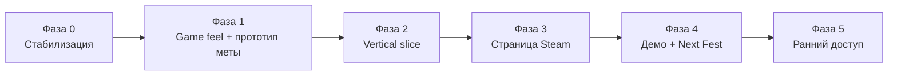

# Дорожная карта

Путь от браузерного прототипа до релиза в раннем доступе в Steam. Этот файл описывает **планы**; текущие возможности — в [README.md](README.md), реализация — в [DEVELOPER_GUIDE.md](DEVELOPER_GUIDE.md).

Оценки рассчитаны на 1–2 разработчиков с фрилансерами на звук, капсулу и трейлер. Сроки — ориентиры, а не обязательства.

## Цель

За 9–12 месяцев довести игру до уровня, на котором её не стыдно поставить в Steam рядом с Brotato, Halls of Torment и Nuclear Throne: страница «Скоро выйдет», играбельное демо на Next Fest и релиз в раннем доступе по цене $7–10.

Техническая база сильная: чистая архитектура, 1101 браузерная проверка, собственный пиксельный рендер. Не хватает трёх вещей, по которым игрок в Steam решает «купить или вернуть деньги»:

1. причины играть 50+ часов,
2. узнаваемого стиля на первом скриншоте,
3. сочного ощущения стрельбы.

## Пять главных решений

1. **Проверить название.** «Alien Shooter» — действующая франшиза Sigma Team в Steam с 2003 года, и это блокер. Рабочее имя уже сменено на Pixel Protocol; осталась проверка по базам товарных знаков (WIPO Global Brand Database, EUIPO, USPTO), домена и ников в соцсетях.
2. **Перейти от «волн до смерти» к рогалайту с мета-прогрессией:** выбор из 3 перков после волны, несколько классов бойцов, постоянная валюта, открытия между забегами.
3. **Прокачать game feel раньше контента:** хит-стоп, отзывчивые попадания, геймпад.
4. **Обернуть игру в десктоп-приложение (Electron + steamworks.js):** достижения, облачные сохранения, Steam Deck, настройки уровня ПК-игры.
5. **Начать маркетинг сейчас, а не перед релизом:** страница Steam через 3–4 месяца, вишлисты копятся с первого дня.

## Разрыв с ожиданием игрока в Steam

| Область | Сейчас | Ожидание игрока | Разрыв |
|---|---|---|---|
| Название и бренд | Рабочее имя Pixel Protocol, проверка не завершена | Уникальное имя, логотип, капсула | Блокер |
| Реиграбельность | Билды из 15 перков; образцы и 6 постоянных улучшений станции переживают смерть | Классы бойцов, открытия, уровни угрозы, 30–100 ч игры | Высокий |
| Контент | 4 сектора за забег (3 уникальных), 5 обычных врагов, 3 босса секторов и свой финальный босс | Больше секторов и врагов, уровни сложности, цели внутри волны | Высокий |
| Ощущение боя | Хит-стоп, криты, squash на попадании, направленная тряска | То же плюс числа урона, анимации смерти | Средний |
| Управление | Клавиатура, мышь и геймпад, переназначение клавиш, вся игра проходится без мыши | Помощь прицеливания, подсказки кнопок, вибрация | Низкий |
| Звук | Полностью синтез, без пространственного позиционирования | Сочные звуки оружия, запоминающийся саундтрек | Высокий |
| Визуал | Технически грамотный пиксель-рендер, процедурные модели | Арт-дирекция, узнаваемые силуэты, анимации смерти | Средний |
| Платформа | Один `index.html`, `localStorage` | Установщик, облачные сохранения, достижения, оверлей | Высокий |
| Настройки | Громкость, движение, размер пикселя, числа урона | Разрешение, V-Sync, FPS-лимит, язык, доступность | Средний |
| Онбординг | Нет обучения | Понятные первые 5 минут без текста | Средний |
| Качество кода | Хорошее, unit- и браузерные проверки | Нет багов, видимых игроку | Низкий |

## Столп 1. Геймплей и реиграбельность

Каждый забег должен давать уникальный билд и оставлять прогресс после смерти.

### 1.1 Структура забега

- [x] **Забег с финалом.** 12 волн, 4 сектора, финальный босс, затем бесконечный режим для рекордов. Длительность пока ближе к 15–20 минутам; 25–35 требует больше контента.
- **Карта маршрута.** После сектора — выбор из 2–3 направлений с разной наградой и риском (элитный сектор, торговец, событие). Опирается на готовый `advanceSector()`.
- **Цели внутри волны**, а не только «убей всех»: удержать точку, сопроводить дрона, закрыть 3 улья, успеть к эвакуации.
- **События сектора:** отключение света (фонарь `F` станет механикой), утечка хладагента в CRYO LAB, перегрев в REACTOR CORE.

### 1.2 Билды внутри забега

- [x] **Выбор 1 из 3 перков** после каждой волны, вместе с магазином. Реализовано, 15 перков; на релиз — 60–80.
- [x] **Билд виден во время боя** — полоса доктрины в HUD.
- [x] **Синергии и теги:** огонь, электричество, взрыв, пробитие, крит, тело. Перк может требовать, чтобы билд уже нёс нужные теги. «ЦЕПНОЙ ОЖОГ» реализован.
- **Модули оружия:** 2 слота на ствол (рикошет, разрывные, большой магазин, самонаведение).
- [x] **Ограничить арсенал.** Три слота плюс пистолет; оружие покупается на складе и сдаётся обратно за 40% цены. `WEAPON_UNLOCK` стал порогом появления в продаже.
- [x] **Магазин с ассортиментом:** 4 случайных товара, реролл за кредиты с растущей ценой, закрепление слота.

### 1.3 Мета-прогрессия

- [x] **Постоянная валюта** (образцы пришельцев), которая сохраняется после смерти.
- [~] **Хаб между забегами:** экран станции с постоянными улучшениями и статистикой забегов есть. Каюта, открытия и редактор бойца в одном пространстве — ещё нет.
- **Классы бойцов** (4–6 к релизу): штурмовик, подрывник, инженер с турелью, медик с регенерацией — своё стартовое оружие и активная способность.
- **Открытия за достижения:** новые перки, стволы в пуле, косметика для редактора.
- **Уровни угрозы:** 10–15 ступеней сложности после первой победы.

### 1.4 Враги и боссы

- Довести обычных врагов до 12–15: щитоносец (уязвим спиной), подрывник, телепортирующийся сталкер, бафер-шаман, минный строитель, зарывающийся снайпер.
- [x] **Элитные модификаторы** на обычных врагах: взрывной, быстрый, бронированный, расщепляющийся (`ELITE_MODS`). Разнообразие без новых моделей; доля растёт с волной, боссы не модифицируются.
- [x] **Свой финальный босс с 3 фазами и сменой арены:** Overmind (`ENEMY_BY_ID.overmind`). Броня → роение → ядро, щит на переходе, кольцо зон опасности (`Hazards`) вместо смены арены.
- По 2 босса на сектор.
- Заменить BFS-поля на flow field с разделением толпы (separation), чтобы орда обтекала игрока.

### 1.5 Онбординг и режимы

- Обучающий сектор на 3–4 минуты без стен текста: движение, рывок, граната, телеграф атаки.
- **Ежедневный забег** с общим seed и таблицей лидеров Steam. Основа уже есть: вся игровая случайность идёт через `game.rng`.
- Локальный ко-оп на двоих — после демо. Онлайн-ко-оп вне первой версии.

## Столп 2. Ощущение боя и управление

Шутер продаётся первыми 10 секундами стрельбы — в трейлере и в демо.

### Сочность попаданий

- [x] Хит-стоп 35–90 мс на крите, на убийстве тяжёлого врага и босса, на попадании рельсы (`HitStop`, `HIT_STOP`).
- [x] Криты с отдельным звуком, усиленной вспышкой и жёлтой меткой попадания.
- [x] Squash & stretch модели врага на попадании.
- [x] Направленная тряска камеры: отдача бьёт назад по стволу, урон отбрасывает от источника.
- [x] Прямой урон RPG и Titan 30MM при контакте дополнительно к взрыву.
- [x] **Смерть врага:** распад на части и кровавые декали были, добавлены лужи кислоты у кислотных типов (`acidPool`, `Hazards`).
- [x] **Гильзы и дым из ствола:** гильзы вылетали и раньше, добавлен нагрев ствола, который стравливается дымом после очереди, а не на каждый выстрел.
- [x] **Числа урона** со слиянием попаданий по цели и отдельным видом крита; отключаются в паузе (`DamageNumbers`).

### Стабильный тайминг

- [x] Фиксированный шаг симуляции 60 Гц с интерполяцией рендера (`FixedStepClock`, `SIM_DT`).
- [x] Ввод сохраняется до тика и не повторяется при догоняющих шагах.
- [ ] Буфер ввода для рывка и гранаты, короткие кадры неуязвимости на рывке.

### Управление

- [x] **Слой действий вместо кодов клавиш** (`ACTIONS`, `InputState.actionDown/actionOnce`) — основа для переназначения, геймпада и подсказок кнопок.
- [x] **Геймпад через Gamepad API:** twin-stick, аналоговые стики с мёртвой зоной, кнопки через тот же слой действий. Опрос раз в игровой шаг, как у клавиатуры.
- [x] **Переназначение всех клавиш** на экране паузы, до трёх на действие, с сохранением и клампом в профиле.
- [ ] Мягкая помощь прицеливания, радиальное меню оружия, вибрация.
- [x] **Все боевые экраны управляются без мыши:** меню, пауза, склад, доктрина, станция, победа, смерть. Навигация двигает нативный фокус браузера, поэтому Enter и Space работают сами (`UiNav`, `pickNeighbour`).
- [x] **Редактор бойца без мыши и экранная клавиатура для позывного** (`#oskScreen`, `OSK_ROWS`, `oskType`). Алфавит клавиатуры сверяется с правилом профиля, предел длины принадлежит профилю.
- [ ] Подсказки кнопок под текущее устройство.
- [ ] Курсор прицела с индикацией разброса и перезарядки.
- [x] Коллизии hitscan с предметами окружения и бочками.

## Столп 3. Арт, UI и звук

Пиксельный 3D-рендер — главное отличие игры; его нужно не менять, а довести до узнаваемого стиля.

### Арт-дирекция

- Стилевой гайд на 1–2 страницы: палитра на сектор, правило «игрок и враги всегда контрастнее фона», толщина контуров, расположение света.
- Узнаваемые силуэты врагов с высоты камеры и цветовая кодировка опасности.
- Анимации врагов процедурными ногами (IK) — дешевле ручной анимации, опыт с ригом рук уже есть.
- Динамический свет как геймплей: аварийные лампы, мигание при появлении босса, свет от выстрелов на стенах.
- Локации с ручными блоками (room templates) поверх генератора.

### UI и подача

- Перерисовать HUD в едином пиксельном стиле с собственным шрифтом (кириллица + латиница).
- История короткими переговорами по рации и терминалами, без катсцен.
- Экран итогов забега: билд, урон по оружию, убийца, награда в мета-валюте, кнопка «ещё раз».

### Звук

- Заменить звуки оружия, попаданий и смертей на сэмплы; синтез оставить для UI и вариаций.
- Оригинальный саундтрек: 6–8 треков со слоями для готовой адаптивной интенсивности.
- Пространственный звук (`PannerNode`).

## Столп 4. Техника и платформа

Переписывать игру на Unity или Godot не нужно: Three.js + десктопная оболочка — рабочий путь в Steam.

### Десктоп-сборка и Steamworks

- **Electron**, а не Tauri: встроенный Chromium даёт одинаковый WebGL 2 на Windows и Linux/Steam Deck. Цена — около 100 МБ к размеру.
- **steamworks.js:** достижения (30–50), Steam Cloud, таблицы лидеров, оверлей, Rich Presence.
- **Steam Deck:** цель — статус Verified. Геймпад во всём UI и экранная клавиатура для позывного готовы; остаются читаемый текст на 1280 × 800, 40–60 FPS и подсказки кнопок под устройство.
- Браузерную сборку сохранить: она станет демо на itch.io и будет вести трафик в Steam.

### Сохранения

- [x] Версия схемы и цепочка миграций (`PROFILE_SCHEMA_VERSION`, `PROFILE_MIGRATIONS`, перенос `as3d_*`); схема 2 добавила мета-прогрессию без потери профилей.
- [x] Строгий разбор булевых значений.
- [ ] Файл сохранения на диске через Electron вместо `localStorage`, атомарная запись и резервная копия.
- [ ] Сохранение забега при выходе (suspend) — для Steam Deck обязательно.

### Детерминизм

- [x] Вся игровая случайность через seeded RNG; `Math.random()` остаётся только в косметике.
- [x] Проверка одинаковых команд по тикам при 30/60/144 Гц и неравномерных кадрах (`replayprobe.js`).
- [ ] Формат записи и проигрывания пользовательских реплеев.

### Настройки и локализация

- [ ] Полноэкранный/оконный режим, разрешение, V-Sync, ограничение FPS, пресеты графики, раздельная громкость, язык.
- [ ] Доступность: режим для дальтоников, размер UI, отключение вспышек, автострельба.
- [ ] Вынести все строки в таблицы. К демо — английский и русский; к релизу — ZH, PT-BR, DE, затем ES, JA, FR. Расширить `sanitizeNickname()` под иероглифы.

### Производительность и качество

- [ ] Бюджет: 60 FPS при 300+ врагах на GTX 1060 / Iris Xe; регулярный прогон на реальном GPU, а не только SwiftShader.
- [ ] Долгий тест на утечки: 60 минут бота с записью `renderer.info` и heap.
- [ ] Сбор крашей и анонимная телеметрия с согласием.
- [x] CI: сборка, unit-тесты, headless-прогон, скриншот меню как артефакт.
- [ ] Выкладка в ветку Steam `beta` через SteamCMD.
- [ ] Разбить `95-game.js`, когда он начнёт расти от мета-прогрессии; вынести контент (перки, враги, волны) в данные.

## Объём контента

Демо должно быть маленьким, но отполированным до релизного качества; релиз — давать 15+ часов до первой полной победы.

| Элемент | Сейчас | Демо (Next Fest) | Ранний доступ | Полный релиз |
|---|---|---|---|---|
| Секторы | 3 по кругу | 2 | 4 + финал | 5–6 + финал |
| Обычные враги | 5 | 8 | 12 | 15+ |
| Элитные модификаторы | 0 | 3 | 6 | 10 |
| Боссы | 3 | 2 | 6 + финальный | 10+ |
| Оружие | 10 покупных, 3 слота | 6 | 14 | 20 |
| Перки | 15 | 25 | 60 | 100 |
| Классы бойцов | 1 | 2 | 4 | 6 |
| Уровни угрозы | — | — | 10 | 15 |
| Достижения Steam | — | — | 30 | 50 |
| Музыкальные треки | синтез | 3 | 6 | 8–10 |
| Языки | 1 (смешанный) | EN, RU | + ZH, PT-BR, DE | + ES, JA, FR |
| Длина полного забега | бесконечно | 15–20 мин | 25–30 мин | 30–35 мин |

Демо ограничивается по содержанию, а не по времени: игрок видит закрытые перки и классы — и жмёт «Добавить в желаемое» на экране финала.

## Маркетинг и Steam

Цель — Next Fest в июне 2027 с демо, страница Steam — в январе 2027. Февральский Next Fest (22 февраля – 1 марта 2027, регистрация до 10 января) наступает слишком рано: участие даётся игре один раз, и тратить его на сырое демо без вишлистов невыгодно. Даты июньского фестиваля Valve ещё не объявила.

Обязательные шаги Steam Direct:

- Сбор $100 за каждую игру; между оплатой и релизом — не меньше 30 дней.
- Страница «Скоро выйдет» — минимум 2 недели до релиза (на практике нужны месяцы); проверка страницы и сборки занимает 1–5 дней.
- Для Next Fest страница и демо должны быть публичными к старту фестиваля, а релиз — после него.

Страница магазина:

- Капсула у профессионального художника — главный фактор клика. Бюджет ориентировочно $300–1500.
- Трейлер 30–60 секунд: стрельба в первые 3 секунды, без логотипов в начале. 5+ GIF в описании.
- Теги: Roguelite, Top-Down Shooter, Twin Stick Shooter, Pixel Graphics, Sci-fi, Aliens, Bullet Hell, Singleplayer.

Где брать вишлисты: короткие видео в TikTok / YouTube Shorts / X про пиксельный рендер; Reddit (r/indiegaming, r/roguelites, r/threejs, r/IndieDev); браузерное демо на itch.io со ссылкой на Steam; тематические фестивали Steam; рассылка ключей средним и маленьким стримерам; Discord-сервер и Steam Playtest.

## Фазы

| Фаза | Период | Что делаем | Критерий готовности |
|---|---|---|---|
| 0. Стабилизация | октябрь 2026 (2–3 нед.) | Название, известные особенности, фиксированный шаг, seeded RNG, версия сохранений, CI | `npm test` зелёный, бой воспроизводится по seed |
| 1. Game feel + мета | ноябрь – декабрь 2026 | Хит-стоп, реакции врагов, геймпад, выбор из 3 перков, постоянная валюта, забег с финалом | 10 плейтестеров: 7 из 10 сами запускают второй забег |
| 2. Vertical slice | январь – февраль 2027 | Арт-гайд, один сектор в финальном качестве, новый HUD, сэмплы звуков, Electron + Steamworks | Скриншоты и GIF готовы для страницы |
| 3. Страница Steam | март 2027 | Капсула, трейлер анонса, описание, Discord, регулярные короткие видео | Страница опубликована, вишлисты идут |
| 4. Демо + Next Fest | апрель – июнь 2027 | Контент демо, Steam Playtest, локализация EN/RU, стримеры, июньский Next Fest | Медиана игры в демо 30+ мин, 0 критических багов |
| 5. Ранний доступ | сентябрь – октябрь 2027 | Контент EA, Steam Deck, достижения, 3 языка сверху, план обновлений | Отзывы 80%+ положительных |

Полный релиз 1.0 — через 6–9 месяцев раннего доступа, по итогам отзывов и телеметрии.

### Состояние фазы 0

Закрыто в версиях 2.2.0–2.6.0: фиксированный шаг с интерполяцией, seeded RNG во всей игровой логике, версия схемы сохранений с миграцией `as3d_*`, строгие булевы значения, CI, и все особенности версии 2.1.0 из раздела 12 гайда (пресет «МЕДИК», hitscan сквозь предметы, прямой урон снарядов, формат профиля).

Осталось в фазе 0: проверка окончательного названия по базам товарных знаков, домену и соцсетям; регистрация в Steamworks и оплата $100 (запускает 30-дневный отсчёт); начало девлога.

## Метрики и риски

Перед каждым этапом сверяемся с цифрами: если порог не достигнут, дорабатываем текущую фазу, а не добавляем контент. Пороги вишлистов — ориентиры инди-сообщества, а не правила Valve.

| Метрика | К фазе | Цель |
|---|---|---|
| Игроки сами запускают 2-й забег | 1 | 70% плейтестеров |
| Конверсия визита страницы в вишлист | 3 | 10%+ |
| Вишлисты перед Next Fest | 4 | 3 000+ |
| Медиана времени в демо | 4 | 30+ мин |
| Вишлисты к релизу | 5 | 10 000+ |
| Положительные отзывы Steam | 5 | 80%+ |
| FPS на Steam Deck | 5 | 40+ стабильно |

| Риск | Вероятность | Что делать |
|---|---|---|
| Претензия по названию | Высокая, если не проверить | Завершить проверку в фазе 0 |
| Раздувание контента вместо полировки | Высокая | Контент только по таблице целей, сначала game feel |
| Невидимость среди сотен рогалайтов | Высокая | Ставка на узнаваемый визуал, короткие видео с раннего этапа |
| Производительность на слабых GPU и Deck | Средняя | Бюджет кадра и тесты на железе с фазы 2 |
| Обратная совместимость сохранений | Средняя | Версия схемы и миграции до первого внешнего теста |
| Выгорание маленькой команды | Средняя | Фриланс на звук, капсулу, трейлер; реалистичные сроки |

## Источники

- [Steam: франшиза Sigma Team Games](https://store.steampowered.com/franchise/SigmaTeam)
- [Steamworks: Steam Next Fest, February 2027](https://partner.steamgames.com/doc/marketing/upcoming_events/nextfest)
- [Steamworks: онбординг Steam Direct](https://partner.steamgames.com/steamdirect)

Правовая оговорка: рекомендации по названию не являются юридической консультацией. Окончательное имя нужно проверить по базам товарных знаков и, при необходимости, с юристом.
